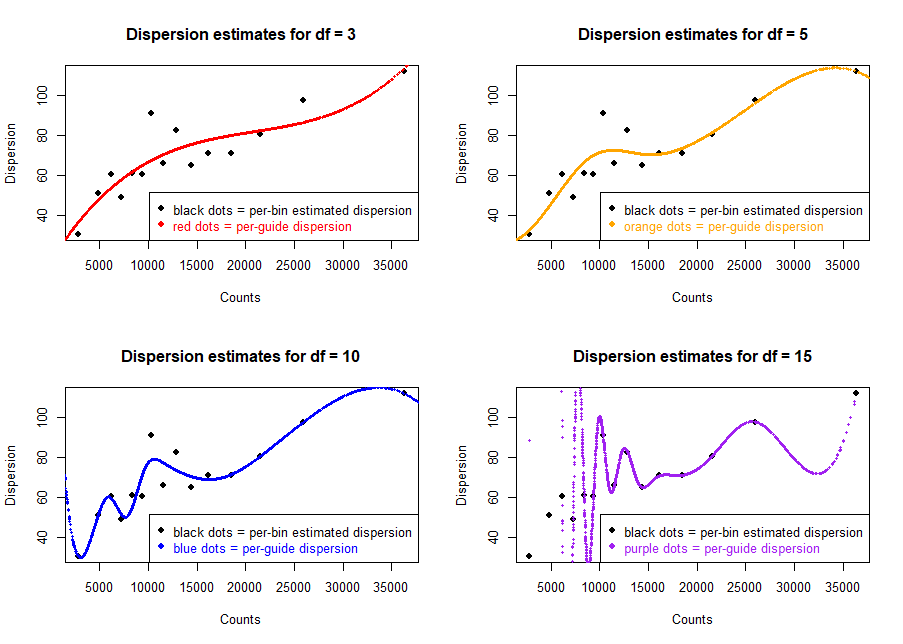
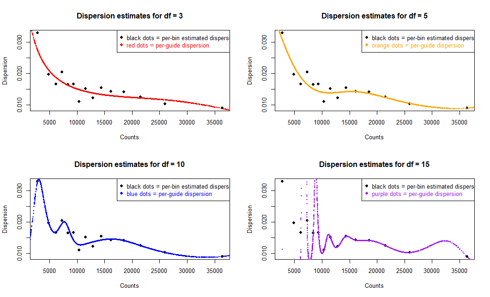

# RELICS :sparkles:: Regulatory Element Location Identification  in CRISPR screens

RELICS is an analysis method for discovering functional sequences from tiling CRISPR screens. The current version (v.2.0) of RELICS uses a Bayesian hierarchical model and considers the overlapping effects of multiple guides, can jointly analyze multiple pools per replicate, and estimates the number of functional sequences supported by the data.

Briefly; RELICS splits the region of interest into segments. It then iteratively places one functional sequence at a time, while considering all previously placed functional sequences. RELICS is a semi-supervised method and takes a set of positive control sgRNAs as input. Note that RELICS currently does not use non-targeting sgRNAs and only analyzes one chromosome at a time. We are working on several extensions and if you have any requests, please feel free to reach out to us!

This work is continuously being improved. Please ask questions or [post issues](https://github.com/patfiaux/RELICS/issues).

# Installation
RELICS requires R version 3.5.1 or higher

## Obtain source code
Clone source code to your desired location with the following command: ```git clone https://github.com/patfiaux/RELICS.git```. Alternatively, download the repository.

## Install requirements
You will need the following packages to run RELICS. If you don't have them, install them using the following commands. Installations will take about 5 minutes on a standard laptop.
## R packages
ggplot2 (for plotting)
```r
install.packages('ggplot2')
```
gridExtra (for combining multiple plots in one figure)
```r
install.packages('gridExtra')
```
poibin (for calculating the Poisson-Binomial)
```r
install.packages('poibin')
```
extraDistr (for calculating the Dirichlet-Multinomial)
```r
install.packages('extraDistr')
```
gtools (for calculating combinations)
```r
install.packages('gtools')
```
## Bioconductor packages
```r
if (!requireNamespace("BiocManager", quietly = TRUE))

    install.packages("BiocManager")
``` 
IRanges (for handling genomic coordinates)
```r
BiocManager::install("IRanges")
```

GenomicRanges (for handling genomic coordinates)
```r
BiocManager::install("GenomicRanges")
```

## Input data format
RELICS requires an input file containing the sgRNA targets and the corresponding counts in the different pools. 
The required columns must have the following information: chromosome, sgRNA target start, sgRNA target end, sgRNA label, ...(sgRNA counts in different pools)...

The columns specifying chromosome, guide target start, guide target end and label are mandatory and must be labelled `chrom`, `start`, `end`, and `label` respectively.

For the columns containing sgRNA counts, names are necessary but the names do not matter as the user will index the columns by number, not by name.

Below is part of the example file in the `RELICS_tutorial` folder. It's a subset from the CD69 CRSIPRa screen by [Simeonov et al.](https://www.nature.com/articles/nature23875). It contains 2 replicates from a FACS experiment. Input pools (`back`) were sorted into no CD69 expression (`baseline`), low, medium and high expression.

| chrom | label | start | end | CD69back_1 | CD69back_2 | CD69baseline_1 | CD69baseline_2 | CD69low_1 | CD69low_2 | CD69medium_1 | CD69medium_2 | CD69high_1 | CD69high_2 |
|----------|----------|----------|----------|----------|----------|-------|------- |------|------|------|------|------|------|
| chr12 | chr | 9913351 | 9913371 | 788 | 926 | 3492 | 968 | 2349 | 1087 | 355 | 923 | 110 | 1023 |
| chr12 | chr | 9913413 | 9913433 | 2656 | 3361 | 4779 | 1579 | 8695 | 3036 | 3177 | 7693 | 730 | 9960 |
| chr12 | chr | 9913414 | 9913434 | 1099 | 1089 | 2102 | 565 | 3705 | 1172 | 1054 | 2669 | 265 | 4727 |
| chr12 | CD69_promoter | 9913429 | 9913449 | 504 | 412 | 2185 | 238 | 580 | 445 | 103 | 570 | 49 | 342 |

## Quickstart with example data in `RELICS_tutorial`

Create a directory for the output files. In this case we recommend creating a folder in the tutorial file: `CD69_tutorial_output`

After that, navigate to the `RELICS_tutorial` folder. In an interactive R session:
```r
setwd('path/to/RELICS/RELICS_tutorial/')
```

### 1. Source the script
```r
source('/path/to/script/RELICS.v2.r')

# if you moved into the RELICS_tutorial folder:
# source('../Code/RELICS.v2.R')
```

### 2. Set up the analysis specification file
Several parameters must be specified by the user before running RELICS. The tutorial walkthrough below describes the most important parameters required to get the analysis going. In the process you will analyze a subset of the CD69 CRISPRa screen from [Simeonov et al.](https://www.nature.com/articles/nature23875).

#### Option 1: Modify the given template in the `RELICS_tutorial` folder (`Example_analysis_specifications.txt`)
There is a template specification file already set up for the example data. It contains the main flags required to run RELICS. The meaning of the different flags are discussed in the next section. 

#### Option 2: Set the flags within `R`
It is also possible to set the parameters directly within R. The following steps demonstrate how to set up parameters for the example specification file. At the end of this section, you will be able to run RELICS on the example data.

1. Flags are set up in a list object

```r
relics.parameters <- list()
```

2. Set the output name of the analysis (`dataName`). Be sure to choose a different name from the existing file so that you don't overwrite the example, and you can compare and check that you got the same flags.

```r
relics.parameters$dataName <- 'CD69_tutorial_analysis'
```

3. Specify the data file.

```r
relics.parameters$DataInputFileLoc <- './Example_data/CD69_data_example.csv'
```

4. RELICS uses a Dirichlet-Multinomial and jointly analyzes all pools from each replicate. In the specification file the replicates are separated by a semicolon (`;`) and referred to by column position in the data file. Within R, the replicates are each an element within a `list()`

Example: `5,7,9,11,13;6,8,10,12,14` represents two replicates. In this example, the pools of each replicate are altering.

Note 1: The input type is a string, such as the example shown above.

Note 2: Analysis across multiple replicates has not been implemented yet, so jointly analyzing all pools (`5,7,9,11,13,6,8,10,12,14`) is not advised!

```r
repl.pools <- list()
repl.pools[[1]] <- c(5, 7, 9, 11, 13)
repl.pools[[2]] <- c(6, 8, 10, 12, 14)

relics.parameters$repl_groups <- repl.pools
```

5. The `label` column assigns each sgRNA to a category. These categories are used in the beginning to specify the training sets. By default a set of sgRNAs overlapping known functional sequences (FSs) have to be provided to the `FS0_label` flag. In this case these are guides overlapping the CD69 promoter. All other sgRNAs are used to train the background parameters. The counts of the sgRNAs overlapping each FS detected are iteratively added to the set of counts used to determine the Dirichlet parameters of the FS.

As an option, it is also possible to specify the sgRNA labels to be used as the background. This is done with the `background_label` flag.

In both cases the flags are given either as string or as vector of strings.

```r
relics.parameters$FS0_label <- 'CD69_promoter' # use all sgRNAs that overlap the CD69 promoter are used to initially train the FS parameters

# option: specify the background parameters
# relics.parameters$background_label <- c('chr', 'exon') # specify what sgRNAs to use to initially train the background parameters
```

6. Specify the number of functional sequences to look for and the number of functional sequences you expect to find. RELICS will look for a total of `max_fs_nr` functional sequences and eight their signal according to the prior which is specified by the `expected_fs_nr`. We recommned setting the `max_fs_nr` to at least `expected_fs_nr` + 3. For larger `expected_fs_nr` we recommend setting `max_fs_nr` to 4/3*`expected_fs_nr`.
```r
# specify the expected number of functional sequences and how many to look for in total
relics.parameters$max_fs_nr <- 15
relics.parameters$expected_fs_nr <- 5 # expected based on previous findings by Simeonov et al., 2017 and Fiaux et al., 2020
```

7. Specify the CRISPR system used. Depending on the CRISPR system used, the area of effect (AoE) is different. By default RELICS assumes that the AoE follows a normal distribution.  For more details see section Area of Effect below.
```r
relics.parameters$crisprSystem <- 'CRISPRa' # other options: CRISPRcas9, CRISPRi, dualCRISPR
```

8. Give the location of the output directory by setting the `out_dir` flag. Either reference to full path or the path from the current working directory. In this example we will do the latter and assume you are in the `RELICS_tutorial` folder. We recommend you create a new file in which the results are saved. Note, RELICS will NOT create non-existent files for you. In this example, first create the `CD69_tutorial_output` folder, then set the flag:
```r
relics.parameters$out_dir <- 'CD69_tutorial_output'
```

9. RELICS now explicityl models the count-dispersion relationship. This drastically imporves performance and helps reduce the number of false positives. See the section `Count-Dispersion modeling` below for details on how to best estimate `nr_disp_bins` and `repl_spline_df`:
```r
# specify the number of bins to group the guide counts into and the degrees of freedom of the spline function for each replicate
relics.parameters$nr_disp_bins <- 15
relics.parameters$repl_spline_df <- list(repl_1 = 3, repl_2 = 3)
```

### 3. Run RELICS
Once you have set up your parameters you can run RELICS by directly giving it the list we set up above, or by first saving it to a `.txt` file. In the latter case, the flags and their values should be separated by a colon (`:`, see `Example_analysis_specifications.txt`).
The CD69 example provided should take about 10 minutes to run on a typical desktop computer. RELICS will look for 15 functional sequences as specified above and report the results in the `finalFS_k15` files.
```r
RELICS(input.parameter.list = relics.parameters)

# option: use the parameter file instead
# RELICS('Example_analysis_specifications.txt')
```

### 4. Output files
RELICS will return several output files. They all start with the `dataName` specified in step 2 above. All output files are one-indexed except for the `.bedgraph` and `.bed` files which are zero-indexed. By default, RELICS will give you the genome segments that were used, as well as the files associated with finding the last functional sequence before convergence:

* `{dataName}_segmentInfo.csv`: This file contains the segments used by RELICS. It contains the information of chromosome, start and end location of the segment, as well as the label of the segment.

|Column name | Column description |
|----------|----------|
| chrom | chromosome of the region |
| start | region start |
| end | region end |
| label | highest overlapping label according to the [label hierarchy](https://github.com/patfiaux/RELICS#advanced-flags) |

* `{dataName}_countsVSdispersion_repl`: The plot of the count-dispersion modeling. It is recommended to check these plots and make sure that the dispersion for each replicate has been well modeled.

* `{dataName}_FS0_seg_llRt.bedgraph`: Bedgarph file of the log-likelihood ratio of each segment containing a functional sequence. This can be a helpfuls representation of the data as it can indicate the number of potential functional sequences. However, a high signal doe not necessarily mean RELICS will detect a functional sequence because the information used to generate this track is reduced and does not correspond to the full RELICS analysis. 

* `{dataName}_FS0_guideLLR.csv`: Contains the log-likeohood ration of each guide overlapping a functional sequence. This can be helpful when sleecting guides for validation.

In all subsequent file names, the pattern `_kX_` refers to `X` functional sequences detected.

* `{dataName}_finalFS_kX_summaryStatPlots.bedgraph`: Plots of the model log-likelihood progression as more FS are detected as well as the per-FS contribution to the model. The top row is adjusted to account for the prior, the bottowm row contains the raw lieklihoods.

* `{dataName}_final_kX_cs_pp.bedgraph`: This file contains the sum of the credible sets of posterior probabilities across all functional sequences detected.

* `{dataName}_finalFS_kX_FS_locations.bed`: This file contains all genome segments part of the functional sequences detected.

* `{dataName}_finalFS_kX_cs_pp.csv`: This file contains the credible set functional sequence probabilities of all functional sequences detected. Each column corresponds to a genome segment, ordered as in `{dataName}_segmentInfo.csv`. Each row corresponds to the functional sequence probabilities of a particular functional sequence. The first row corresponds to FS0, the second to FS1 etc.

* `{dataName}_finalFS_kX_model_lls.csv`: This file contains the per-functional sequence log-likelihood contribution to the model improvement as well as the model lig-likelihood progression. The raw likelihoods are also given, which have not yet been weighted by the prior given for the number of FS.

|Column name | Column description |
|----------|----------|
| FS | the functional sequence |
| fs_ll_contrib | contribution of each FS to the model |
| raw_fs_ll_contrib | raw contribution of each FS to the model |
| model_ll | model log-likelihood progression |
| raw_model_ll | raw model log-likelihood progression |
| cs_raw_pp | sum of the credible set posterior probability |

* `{dataName}_finalFS_kX_alphas.csv`: This file contains the dirichlet sorting parameters for the background (`alpha0`) and for functional sequences (`alpha1`) for all replicates.

* `{dataName}_finalFS_kX_disp.csv`: This file contains the per-guide assigned dispersions.

## Count-dispersion modeling
RELICS explicitly models the relationship between guide counts and their dispersion (variance). It has been observed that the dispersion of biological count data changes with increasing count size (see Fig. 1 in [Love, Huber, Anders., 2014](https://genomebiology.biomedcentral.com/articles/10.1186/s13059-014-0550-8)). We use a spline function to account for the wide range of possible count-dispersion relationships. To estimate the correct spline function we first sort and bin the guides according to their total per-replicate counts. Using differen degrees of freedom (number of points that a spline can use to fit to the data) we compute the the best fit for the number of bins followed by  calculating the dispersion for each individual guide. Based on the plotted output the best fit can then be used to the RELICS analysis.

The splnie parameters have to be estimated for each replicate. While usually there isn't much difference between replicates we have observed cases where it's beneficial to use different degrees of freedom across different replciates.

We proivde a function to help users determine their correct settings. `spline_fitting` takes the same parameters as the main analysis function (`RELICS`) so you'll only have to set up the input list once. By default `spline_fitting` will return the fit to 3, 5, 10 and 15 degrees of freedom for a given bin size. We generally recommend bin sizes around 20 to 100. Increasing the number of bins can help in cases where some bins have very high counts.

First, source the spline modling script and the RELICS code.
```r
source('/path/to/script/estimate_spline_fitting.R')
source('/path/to/script/RELICS.v2.r')

# if you moved into the RELICS_tutorial folder:
# source('../Code/estimate_spline_fitting.R')
```

```
# use the same parameter list used for the RELICS analysis
analysis.specs$nr_disp_bins <- 15 
spline_fitting(input.parameter.list = analysis.specs, repl = 1) # plot the splie fits for replicate 1
```



In the example above it seems having 3 degrees of freedom with 15 bins leads to the best result. The spline does not overfit to the data. In general, if two splines fit approximately equelly well it's better to pick the one with less degrees of freedom to avoid overfitting. Not that here we've plotted the 1/dispersion values. This helps with the resolution to choose the best fit. If you are interested in seeing what the final dispersion values look like you can set the `plot.true.disp` flag to `TRUE`.

```
# use the same parameter list used for the RELICS analysis
spline_fitting(input.parameter.list = relics.parameters,repl = 1, plot.true.disp = TRUE)
```




It is also possible to disable the dispersion modeling. Set the mean-variance type to independent and disbale the disperison modeling.
```
relics.parameters$mean_var_type <- 'independent'
relics.parameters$model_dispersion <- FALSE
```


# Advanced flags

### Name the pools
In the output files it can be convenient to have the pools named.
```
# specify the names of the different pools. Helps with naming hyperparameters in the output files
all.repl.names <- list()
all.repl.names[[1]] <- c("back", "baseline", "low", "medium", "high")
all.repl.names[[2]] <- c("back", "baseline", "low", "medium", "high")
relics.parameters$pool_names <- all.repl.names
```

### Specify guide efficiency
RELICS performs better if guide efficeincies are provided. They can be given in a separate .csv file as long as the order is the same as in the input data. An easier option is to directly add them to the input file and specify the column within
```
relics.parameters$guide_efficiency_loc <- relics.parameters$DataInputFileLoc
relics.parameters$guide_efficiency_cols <- c(21)
```

As additional output file RELICS will give the computed guide-efficeincy coefficient used in the logistic model. By default RELICS will recompute these parameters after each FS placement. This can help in the case of noisy guide scores, which will allow RELICS to downweight their importance on the results. However, if you trust your guide efficeincy scores than you can also fix them to their input values.
```
relics.parameters$fixed_ge_coeff <- TRUE
```

### Recording additional information
By default RELICS only returns the files from section 4. However, it's possible to get additional info such as the raw posterior probabilities and raw credible sets. All these results have not been weighted by the prior hence they are still raw.
```r
relics.parameters$record_pp <- TRUE # returns .csv with all posterior probabilities for each FS and bedgraph of combined prosteriors
relics.parameters$record_cs_pp <- TRUE # returns .csv with all credible set posterior probabilities for each FS and bedgraph of combined credible set prosteriors
```

### Record output at each iteration
By default, RELICS only outputs files once it has discovered all functional sequences. However, it is possible to get the same output for every functional sequence detected. This can be useful when data sets take a long time to run. The intermediate files can already reveal where the first set of functional sequences are located while RELICS still searches for more. To record all intermediate files set the `record.all.fs` to `TRUE` when running RELICS.
```
RELICS(input.parameter.list = relics.parameters, record.all.fs = TRUE)
```

### Set the label hierarchy
RELICS combines information of guides which overlap with their guide effect. This can lead to scenarios where guides with different labels overlap. By default the label with fewer occurrences in the data set is chosen. However, it is also possible for the user to specify the hierarchy by explicitly setting the `labelHierarchy` flag.

The rightmost label has highest priority. Using the example below: if a region has overlapping guides labeled as both promoter overlapping (`CD69_promoter`) as well as targeting guides with unknown effect (`chr`), then the region will be assigned the label with higher priority in the hierarchy - in this case being `CD69_promoter`.

If specifying the `labelHierarchy`, all labels should be provided. Guides with labels that were not included will not be properly used the analysis. In this case this means also specifying the `exon` label for guides overlapping CD69 exons.

```r
relics.parameters$labelHierarchy <- c('chr', 'exon', 'CD69_promoter')
```

### Compute the likelihood that at FS spans multiple segments
By default, RELICS considers functional sequences to be up to 10 genome segments. In the case of 100bp segments that would correspond to 1kb. It is possible to either increase or decrease this functional sequence length by adjusting the `nr_segs` flag. Note, by increasing the number, RELICS' runtime will increase as it will consider all possible functional sequence sizes from 1 up to `nr_segs`.
```r
relics.parameters$nr_segs <- 10 # default is 10
```

RELICS uses a truncated geometric distribution for modeling the probability of a functional sequence of length `x`. By default RELICS uses `p = 0.1`. To adjust that, for either being more or less restrictive for having longer functional sequences, use the `geom_p` flag.
```r
relics.parameters$geom_p <- 0.1 # default is 0.1
```

### Modify stopping criteria
Usually RELICS discovers the specified `max_fs_nr` functional sequences. However, it is possible that the data does not contain as many functional sequences. In this case RELICS will terminate realy. Specifically, RELICS will terminate if the largest credible set sum is below `min_cs_sum` (default: 0.01). This can be adjusted by changing the threshold
```r
relics.parameters$min_cs_sum <- 0.01
```

### Modify credible set parameters
RELICS by default computes a relative 90% credible set across 10 genome segments. This can be adjusted with `cs_threshold` and `cs_sw_size`. Restricting the number of segments considered in a credible set can lead to narrower credible sets while changing the threshold adjusts the number of segments that are included.
```r
relics.parameters$cs_threshold <- 0.9
relics.parameters$cs_sw_size <- 10
```

### Modify segment length
By default RELICS segments the data into ~100bp segments. This can be adjusted with the `seg_dist` flag
```r
relics.parameters$seg_dist <- 100 # default is 100
```

### Recomputing hyperparameters
By default RELICS computes the hyperparameters based on the guides labelled as FS0 and then keeps the hyperparameters the same throughout the rest of the analysis. However, it's also possible to recompute the hyperparameters after each placement of a functional sequence. This could help in a case where the signal at FS0 is a lot stronger than all other functional sequences.
```r
relics.parameters$fix_hypers <- FALSE
```

### Changing the Are of Effect (AoE)
By default RELICS assumes a normal AoE. This means that base pairs further away from a guide target site are less likely to be perturbed. By default we assume that for Cas9 only half the cell containing a guide have a perturbation more than 10bp away from the target site. For CRISPRi and CRISPRa that we assume that this is the case for 200bp away from the target site. In both cases this is modeled using a normal distribution with adjusted standard deviations. We also specify a max. range beyond which it's unlikely that a base pair is affected `crisprEffectRange`. 
```r
# for a Cas9 system
relics.parameters$normal_areaOfEffect_sd <- 8.5
relics.parameters$crisprEffectRange <- 21

# for a CRISPRi or CRISPRa system
relics.parameters$normal_areaOfEffect_sd <- 170 
relics.parameters$crisprEffectRange <- 415
```

It is also possible to nor model the AoE and assume a uniform parturbation instead where it's equally likely for any base pair to be perturbed
```r
relics.parameters$areaOfEffect_type <- 'uniform'
```


## Input data format contd. (for backward compatibility)
Instead of providing one joint file containing both coordinates and counts it is also possible to supply them separately. In this case the format is the following:
1. A **guide information file**, containing information about all the simulated guides (chromosome, start, end, label).
2. A **counts file**, containing the counts for each guide in each pool.

The counts file contains only the counts for each guide for each experiment. Column names are necessary but the names do not matter as the user will index the columns by number, not by name.

Example count file: 2 replicates from a FACS experiment. Input pools was sorted into high, medium and low expression

| repl1_input | repl1_high | repl1_med | repl1_low | repl2_input | repl2_high | repl2_med | repl2_low |
|----------|----------|-------|------- |------|------|------|------|
| 11 | 9 | 12 | 11 | 152 | 119 | 189 | 102 |
| 68 | 81 | 39 | 67 | 360 | 339 | 280 | 821 |
| 96 | 89 | 109 | 17 | 3 | 4 | 5 | 0 |
| 104 | 97 | 116 | 38 | 190 | 198 | 194 | 23 |

The guide information file contains all remaining info about the guides such as targeting position and type of guide (positive control, negative control, exon targeting etc.). Non-targeting controls should be specified by setting `chrom`, `start`, and `end` to NA. The columns specifying chromosome, guide target start, guide target end and label are mandatory and must be labelled `chrom`, `start`, `end`, and `label` respectively.

| chrom | start | end | label |
|----------|----------|----------|----------|
| chr8 | 128704468 | 128704488 | chr |
| chr8 | 128704469 | 128704489 | chr |
| NA | NA | NA | neg |
| chr8 | 128704482 | 128704502 | exon |

Row 1 in the count file should correspond to the guide in row 1 in the info file. If the two files are given then that has to be specified accordingly in the input
```
relics.parameters$CountFileLoc <- 'location/of/count/file'
relics.parameters$sgRNAInfoFileLoc <- 'location/of/info/file'
RELICS(input.parameter.list = relics.parameters, data.file.split = TRUE)
```

